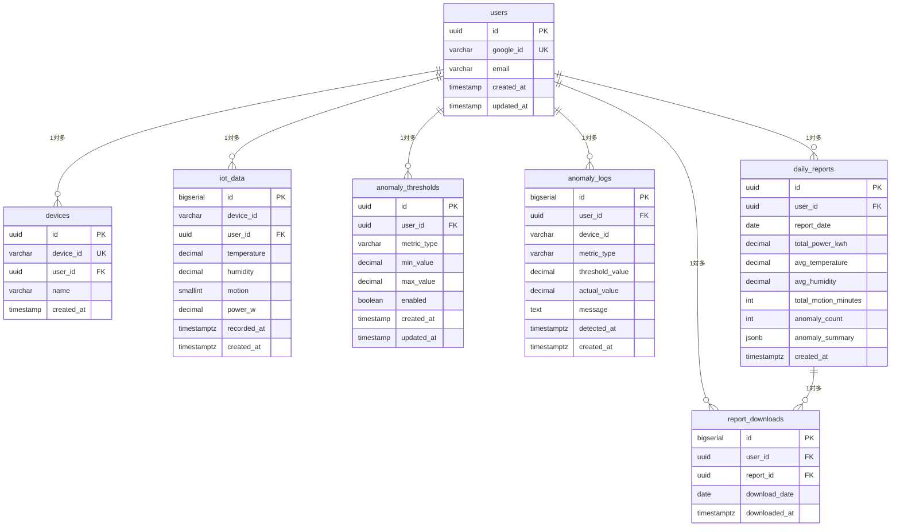

# DB設計書

## Home Smart Factory -- IoT設備監視基盤

------------------------------------------------------------------------

# 1. 概要

- DBMS: PostgreSQL（Amazon RDS）
- 文字コード: UTF-8
- タイムゾーン: UTC（アプリケーション層でJSTに変換）

------------------------------------------------------------------------

# 2. ER図



------------------------------------------------------------------------

# 3. テーブル定義

## 3.1 users（ユーザー）

Googleログイン時に初回登録されるユーザー情報。

| カラム名 | 型 | NULL | デフォルト | 説明 |
|---|---|---|---|---|
| id | uuid | NOT NULL | gen_random_uuid() | PK |
| google_id | varchar(255) | NOT NULL | - | Google OAuth のsub（一意） |
| email | varchar(255) | NOT NULL | - | Googleアカウントのメールアドレス（通知先） |
| created_at | timestamp | NOT NULL | now() | 登録日時 |
| updated_at | timestamp | NOT NULL | now() | 更新日時 |

**制約・インデックス**
- PRIMARY KEY: id
- UNIQUE: google_id
- INDEX: email

**ライフサイクル**
- 登録: Googleログイン時に自動登録
- 更新: なし（Googleアカウントの情報は更新されない前提）
- 削除: ユーザーが退会する際に削除。以下を順に削除する（アプリケーション層で制御）
  1. iot_data（device_id経由、アプリ層）
  2. anomaly_logs（device_id経由、アプリ層）
  3. report_downloads（ON DELETE CASCADE）
  4. daily_reports（ON DELETE CASCADE）
  5. anomaly_thresholds（ON DELETE CASCADE）
  6. devices（ON DELETE CASCADE）
  7. users

---

## 3.2 devices（デバイス）

ユーザーが保有するIoTデバイス。

| カラム名 | 型 | NULL | デフォルト | 説明 |
|---|---|---|---|---|
| id | uuid | NOT NULL | gen_random_uuid() | PK |
| device_id | varchar(100) | NOT NULL | - | デバイス識別子（例: "room01"） |
| user_id | uuid | NOT NULL | - | FK → users.id |
| name | varchar(255) | NULL | - | デバイス表示名 |
| created_at | timestamp | NOT NULL | now() | 登録日時 |

**制約・インデックス**
- PRIMARY KEY: id
- UNIQUE: device_id
- FOREIGN KEY: user_id → users.id ON DELETE CASCADE
- INDEX: user_id

**ライフサイクル**
- 登録: ユーザーが新しいデバイスを追加する際に登録
- 更新: デバイスの表示名を変更する際に更新
- 削除: ユーザーがデバイスを削除する際に削除。以下を順に削除する（アプリケーション層で制御）
  1. iot_data WHERE device_id = 削除対象（アプリ層。FKなしのため）
  2. anomaly_logs WHERE device_id = 削除対象（アプリ層。FKなしのため）
  3. devices

---

## 3.3 iot_data（IoTデータ）

IoTデバイスから収集したセンサーデータ。**保持期間: 90日**

| カラム名 | 型 | NULL | デフォルト | 説明 |
|---|---|---|---|---|
| id | bigserial | NOT NULL | - | PK |
| device_id | varchar(100) | NOT NULL | - | デバイス識別子 |
| user_id | uuid | NOT NULL | - | FK → users.id |
| temperature | decimal(5,2) | NULL | - | 温度（℃） |
| humidity | decimal(5,2) | NULL | - | 湿度（%） |
| motion | smallint | NULL | - | 人感センサー（0: 未検知、1: 検知） |
| power_w | decimal(8,2) | NULL | - | 消費電力（W） |
| recorded_at | timestamptz | NOT NULL | - | データ取得時刻 |
| created_at | timestamptz | NOT NULL | now() | レコード登録日時 |

**制約・インデックス**
- PRIMARY KEY: id
- FOREIGN KEY: user_id → users.id ON DELETE CASCADE
- INDEX: (device_id, recorded_at) — 時系列クエリ用
- INDEX: (user_id, recorded_at) — ユーザー別集計用

**ライフサイクル**
- 登録: IoTデバイスからのデータ受信時に登録
- 更新: なし（データは不変）
- 削除: ECSバッチにより90日を超えたレコードを定期削除する

---

## 3.4 anomaly_thresholds（異常検知閾値設定）

ユーザーが設定する異常検知条件。

| カラム名 | 型 | NULL | デフォルト | 説明 |
|---|---|---|---|---|
| id | uuid | NOT NULL | gen_random_uuid() | PK |
| user_id | uuid | NOT NULL | - | FK → users.id |
| metric_type | varchar(50) | NOT NULL | - | 検知対象（temperature / humidity / power_w） |
| min_value | decimal(8,2) | NULL | - | 下限閾値 |
| max_value | decimal(8,2) | NULL | - | 上限閾値 |
| enabled | boolean | NOT NULL | true | 有効フラグ |
| created_at | timestamp | NOT NULL | now() | 登録日時 |
| updated_at | timestamp | NOT NULL | now() | 更新日時 |

**metric_type の値**

| 値 | 説明 |
|---|---|
| temperature | 温度の上限/下限超過 |
| humidity | 湿度の上限/下限超過 |
| power_w | 消費電力の上限超過 |

**制約・インデックス**
- PRIMARY KEY: id
- FOREIGN KEY: user_id → users.id ON DELETE CASCADE
- INDEX: (user_id, metric_type)

**ライフサイクル**
- 登録: ユーザーが異常検知条件を設定する際に
- 更新: ユーザーが条件を変更する際に更新
- 削除: ユーザーが条件を削除する際に削除

---

## 3.5 anomaly_logs（異常検知ログ）

検知された異常の記録。**保持期間: 1年**

| カラム名 | 型 | NULL | デフォルト | 説明 |
|---|---|---|---|---|
| id | bigserial | NOT NULL | - | PK |
| user_id | uuid | NOT NULL | - | FK → users.id |
| device_id | varchar(100) | NOT NULL | - | デバイス識別子 |
| metric_type | varchar(50) | NOT NULL | - | 検知対象 |
| threshold_value | decimal(8,2) | NULL | - | 設定閾値 |
| actual_value | decimal(8,2) | NULL | - | 実測値 |
| message | text | NULL | - | 異常内容の説明文 |
| detected_at | timestamptz | NOT NULL | - | 異常検知日時 |
| created_at | timestamptz | NOT NULL | now() | レコード登録日時 |

**制約・インデックス**
- PRIMARY KEY: id
- FOREIGN KEY: user_id → users.id ON DELETE CASCADE
- INDEX: (user_id, detected_at) — 一覧取得用

**ライフサイクル**
- 登録: 異常が検知された際に登録
- 更新: なし（ログは不変）
- 削除: ECSバッチにより1年を超えたレコードを定期削除する

---

## 3.6 daily_reports（日次レポート）

ECSバッチが生成する前日分集計レポート。**保持期間: 1年**

| カラム名 | 型 | NULL | デフォルト | 説明 |
|---|---|---|---|---|
| id | uuid | NOT NULL | gen_random_uuid() | PK |
| user_id | uuid | NOT NULL | - | FK → users.id |
| report_date | date | NOT NULL | - | レポート対象日（前日の日付） |
| total_power_kwh | decimal(10,4) | NULL | - | 総電力消費量（kWh） |
| avg_temperature | decimal(5,2) | NULL | - | 平均温度（℃） |
| avg_humidity | decimal(5,2) | NULL | - | 平均湿度（%） |
| total_motion_minutes | int | NULL | - | 総在室時間（分） |
| anomaly_count | int | NOT NULL | 0 | 異常検知件数 |
| anomaly_summary | jsonb | NULL | - | 異常検知内容（デバイス別サマリー） |
| created_at | timestamptz | NOT NULL | now() | 生成日時 |

**anomaly_summary の形式例**
```json
[
  {
    "device_id": "room01",
    "metric_type": "temperature",
    "count": 3,
    "max_value": 32.1
  }
]
```

**制約・インデックス**
- PRIMARY KEY: id
- FOREIGN KEY: user_id → users.id ON DELETE CASCADE
- UNIQUE: (user_id, report_date) — 1ユーザー1日1レポート
- INDEX: (user_id, report_date DESC)

**ライフサイクル**
- 登録: ECSバッチが前日分の集計を行い、毎日午前3時に生成
- 更新: なし（レポートは不変）
- 削除: ECSバッチにより1年を超えたレコードを定期削除する

---

## 3.7 report_downloads（レポートダウンロード履歴）

ダウンロード回数制限（1日3回）の管理に使用。

| カラム名 | 型 | NULL | デフォルト | 説明 |
|---|---|---|---|---|
| id | bigserial | NOT NULL | - | PK |
| user_id | uuid | NOT NULL | - | FK → users.id |
| report_id | uuid | NOT NULL | - | FK → daily_reports.id |
| download_date | date | NOT NULL | - | ダウンロード実施日（JST日付） |
| downloaded_at | timestamptz | NOT NULL | now() | ダウンロード日時 |

**制約・インデックス**
- PRIMARY KEY: id
- FOREIGN KEY: user_id → users.id ON DELETE CASCADE
- FOREIGN KEY: report_id → daily_reports.id ON DELETE CASCADE
- INDEX: (user_id, download_date) — 当日のダウンロード回数カウント用

**ライフサイクル**
- 登録: ユーザーがレポートをダウンロードする際に登録
- 更新: なし（ダウンロード履歴は不変）
- 削除: ECSバッチにより1年を超えたレコードを定期削除する

**備考**
- ダウンロード前に `SELECT COUNT(*) WHERE user_id = ? AND download_date = today` で件数確認し、3件未満のみ許可する

------------------------------------------------------------------------

# 4. カスケード削除ポリシー

## 4.1 ユーザー削除時

| 削除順 | テーブル | 削除方式 | 理由 |
|---|---|---|---|
| 1 | iot_data | アプリ層（device_id WHERE句） | device_idはvarcharのためDBカスケード不可 |
| 2 | anomaly_logs | アプリ層（device_id WHERE句） | 同上 |
| 3 | report_downloads | DB CASCADE（user_id FK） | - |
| 4 | daily_reports | DB CASCADE（user_id FK） | - |
| 5 | anomaly_thresholds | DB CASCADE（user_id FK） | - |
| 6 | devices | DB CASCADE（user_id FK） | - |
| 7 | users | 本体削除 | - |

## 4.2 デバイス削除時

| 削除順 | テーブル | 削除方式 | 理由 |
|---|---|---|---|
| 1 | iot_data | アプリ層（device_id WHERE句） | device_idはvarcharのためDBカスケード不可 |
| 2 | anomaly_logs | アプリ層（device_id WHERE句） | 同上 |
| 3 | devices | 本体削除 | - |

> **NOTE:** `iot_data` と `anomaly_logs` の `device_id` はvarchar型のため、DBレベルのON DELETE CASCADEが効かない。アプリ層のDELETEとDBカスケードは**同一トランザクション内に束ねる**こと。途中で失敗した場合はROLLBACKにより全削除がなかったことになる。

------------------------------------------------------------------------

# 5. データ保持・削除方針

| テーブル | 保持期間 | 削除方式 |
|---|---|---|
| iot_data | 90日 | ECSバッチによる定期削除（timestamp基準） |
| anomaly_logs | 1年 | ECSバッチによる定期削除（detected_at基準） |
| daily_reports | 1年 | ECSバッチによる定期削除（report_date基準） |
| report_downloads | 1年 | ECSバッチによる定期削除（download_date基準） |
| users / devices / anomaly_thresholds | 無期限 | - |
