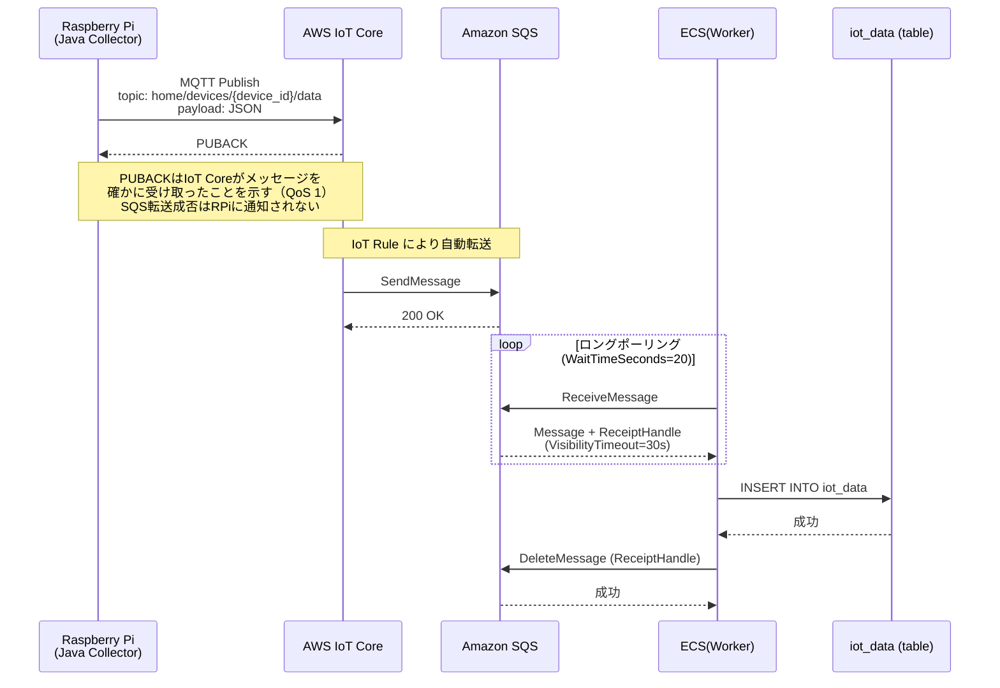
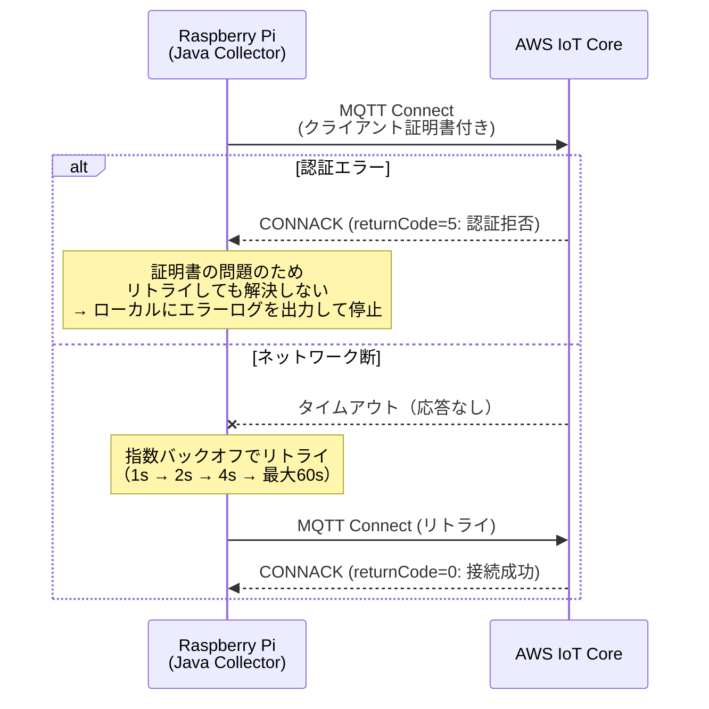
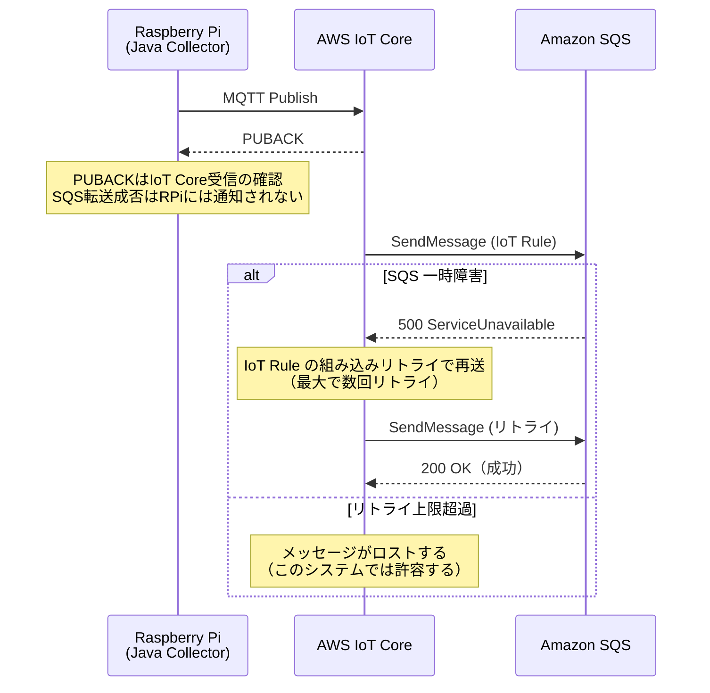
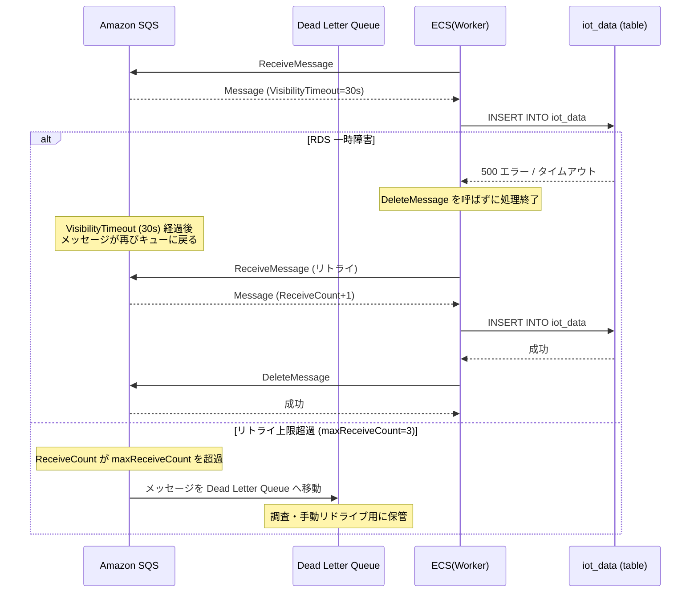
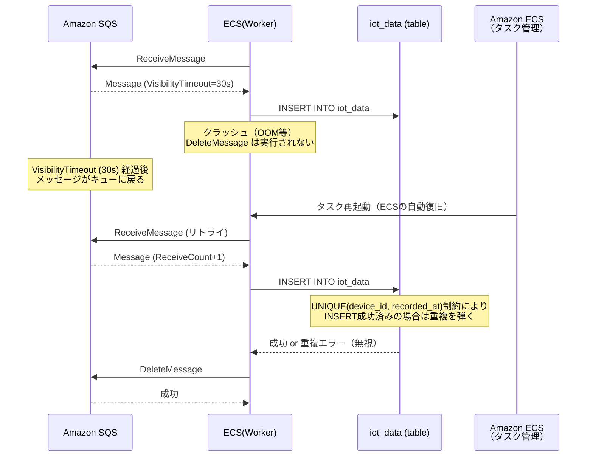

# シーケンス図: IoTデータ収集

## Home Smart Factory -- IoT設備監視基盤

------------------------------------------------------------------------

# 1. 正常系

------------------------------------------------------------------------

# 2. エラー系

## 2.1 MQTT接続失敗（認証エラー / ネットワーク断）

**発生箇所:** Raspberry Pi → AWS IoT Core

**原因:**
- IoT Core に登録された証明書の失効・不一致
- ネットワーク断

---

## 2.2 IoT Core → SQS 転送失敗

**発生箇所:** AWS IoT Core → Amazon SQS

**原因:**
- SQS 一時障害
- IoT Rule の設定ミス

> **設計メモ:** IoT Core の Error Action に別 SQS（DLQ）を設定することで転送失敗を補足できるが、本システムでは IoTデータのロストは許容し、シンプルな構成とする。

---

## 2.3 RDS 書き込み失敗 → SQS リトライ → DLQ

**発生箇所:** ECS Worker → Amazon RDS

**原因:**
- RDS 一時障害 / 接続タイムアウト
- データバリデーションエラー（不正な JSON など）

---

## 2.4 ECS Worker クラッシュ（処理途中）

**発生箇所:** ECS Worker がメッセージ処理中にクラッシュ

**原因:**
- OOM / プロセス異常終了

------------------------------------------------------------------------

# 3. エラー対応まとめ

> **補足:** RPi は PUBACK（QoS 1）により IoT Core へのメッセージ到達を確認できる。ただし SQS への転送成否は RPi には通知されない。

| エラー箇所 | エラー内容 | 挙動 | データロスト |
|---|---|---|---|
| RPi → IoT Core | 認証エラー | ローカルログ出力・停止 | あり（停止中のデータ） |
| RPi → IoT Core | ネットワーク断 | 指数バックオフでリトライ | なし |
| IoT Core → SQS | SQS一時障害 | 組み込みリトライ | なし（通常） |
| IoT Core → SQS | リトライ上限超過 | メッセージロスト | あり（許容） |
| ECS(Worker) → RDS | RDS一時障害 | VisibilityTimeout後にSQSリトライ | なし |
| ECS(Worker) → RDS | リトライ上限超過 | DLQへ移動 | なし（DLQに保管） |
| ECS(Worker) クラッシュ | OOM等 | ECS自動復旧 + SQSリトライ | なし |
