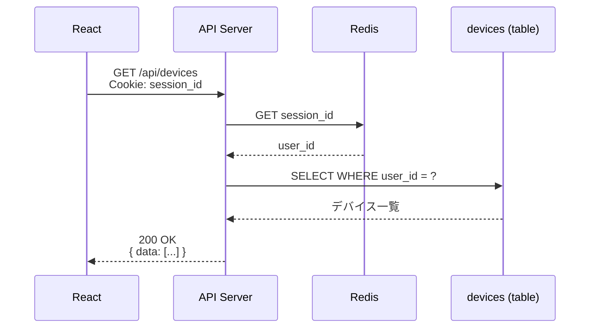
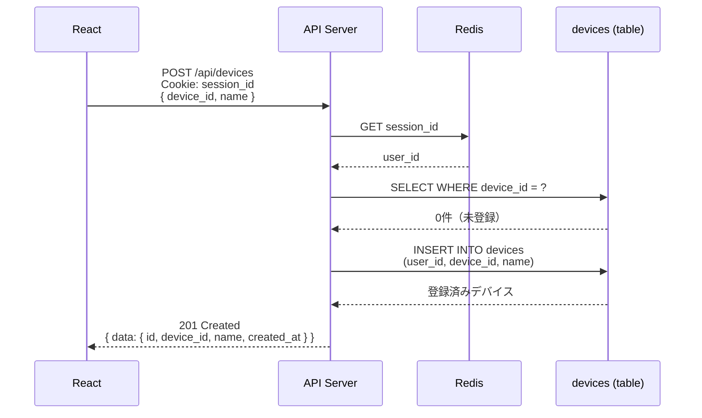
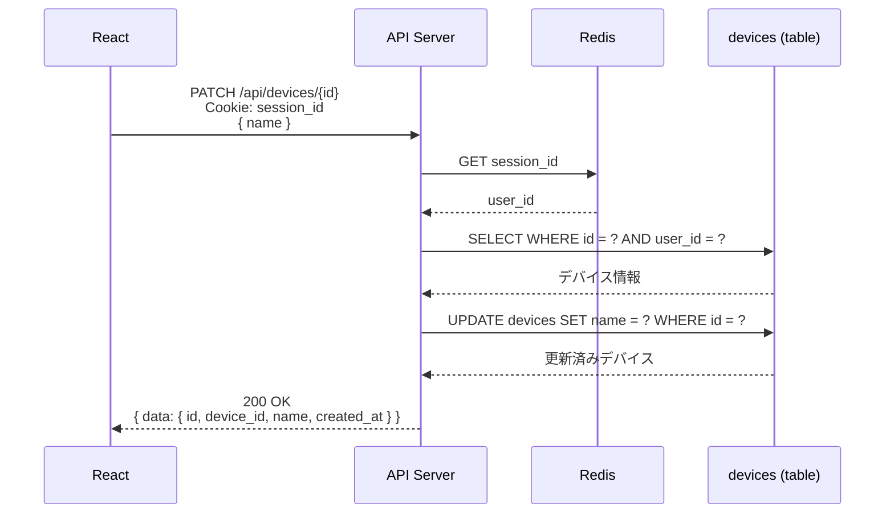
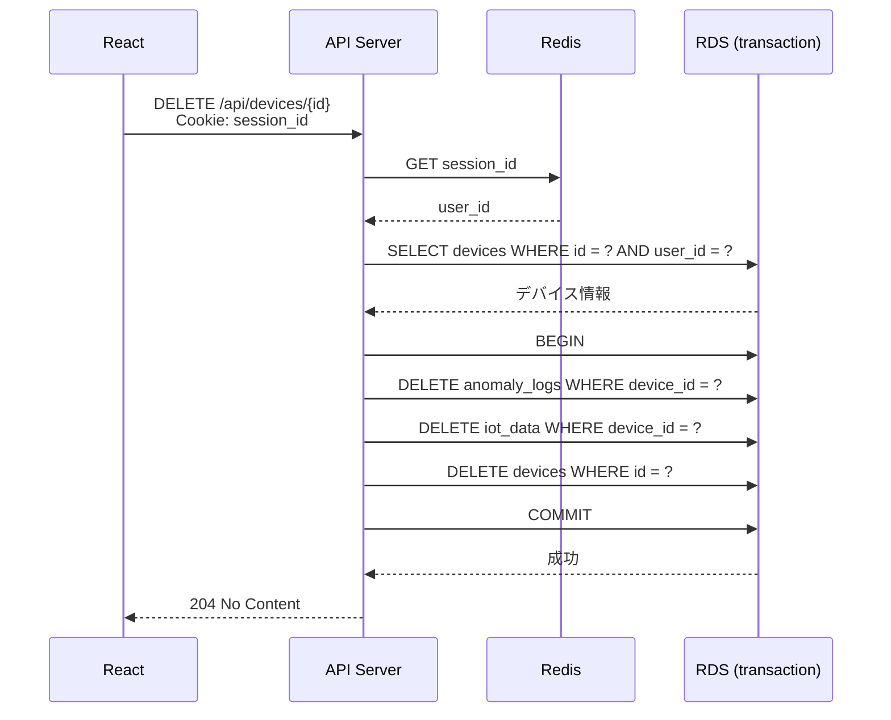
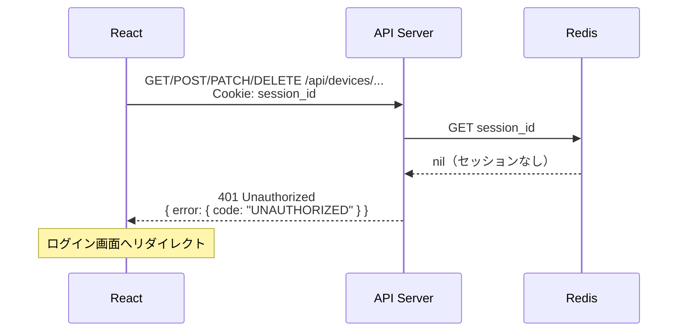
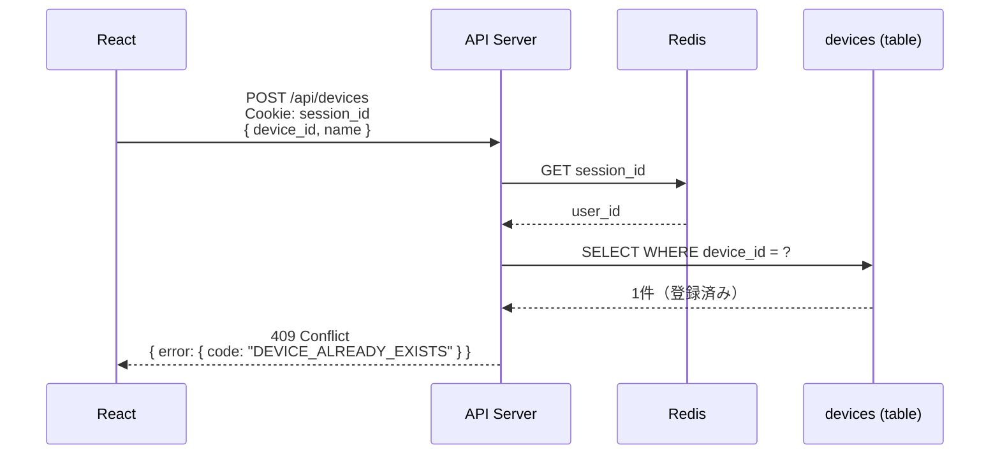
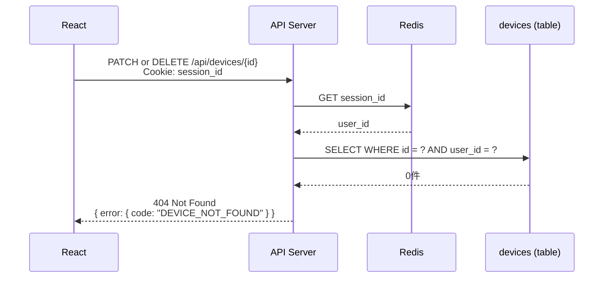
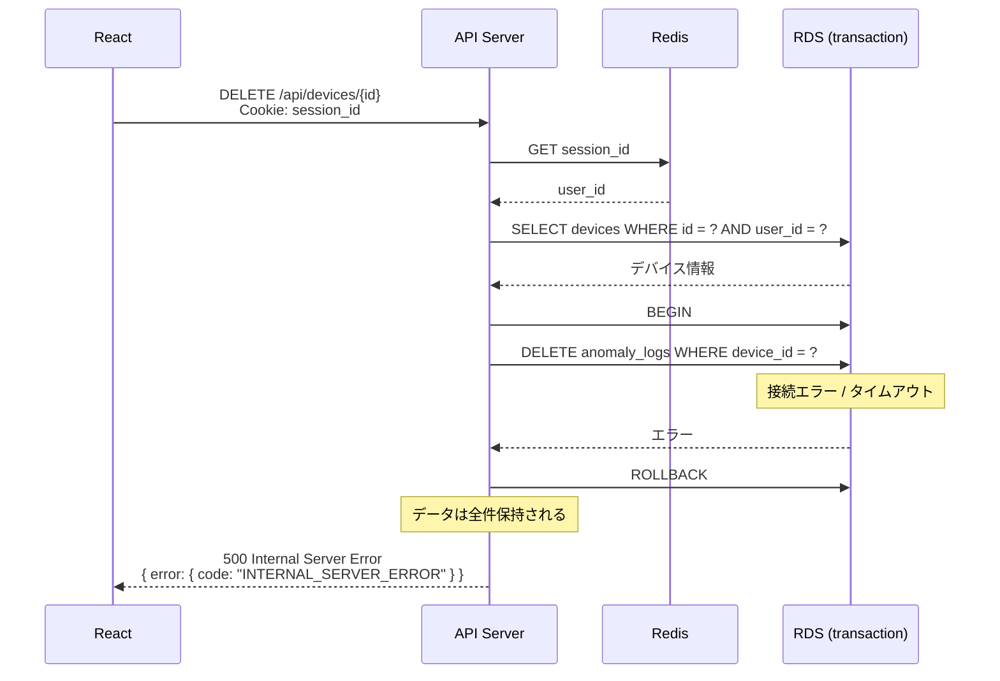
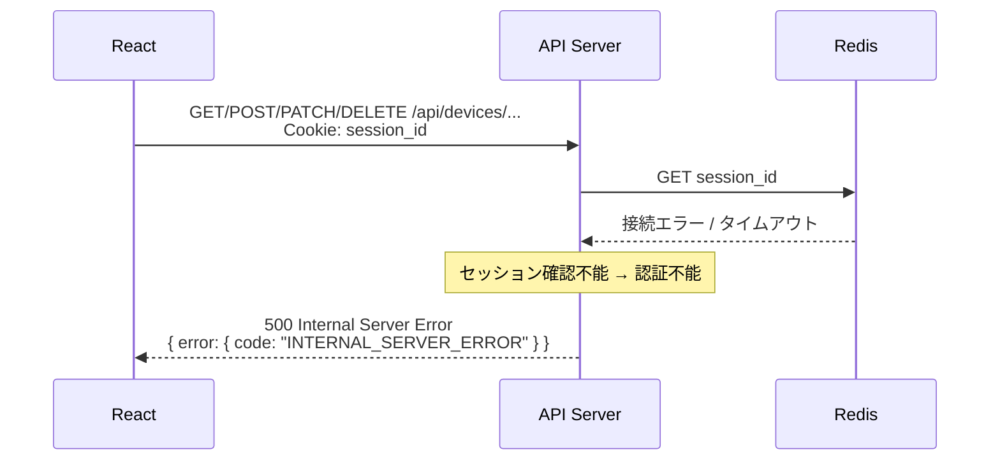

# シーケンス図: デバイス管理

## Home Smart Factory -- IoT設備監視基盤

------------------------------------------------------------------------

# 1. 正常系

## 1.1 デバイス一覧取得

---

## 1.2 デバイス登録

---

## 1.3 デバイス名更新

---

## 1.4 デバイス削除

関連する `iot_data`・`anomaly_logs` を同一トランザクション内で削除する。

------------------------------------------------------------------------

# 2. エラー系

## 2.1 未認証（セッション無効）

**発生箇所:** React → API Server

**原因:**
- セッションの有効期限切れ
- 不正な session_id

---

## 2.2 device_id 重複（デバイス登録時）

**発生箇所:** API Server → devices

**原因:**
- 同じ `device_id` が既に登録されている

---

## 2.3 デバイスが存在しない / 他ユーザーのデバイス

**発生箇所:** API Server → devices

**原因:**
- 指定した `id` が存在しない
- 他ユーザーのデバイスへのアクセス

> **設計メモ:** 他ユーザーのデバイスも404で返す。リソースの存在を推測させないため。

---

## 2.4 トランザクション失敗（デバイス削除時）

**発生箇所:** API Server → RDS

**原因:**
- RDS 障害 / 接続タイムアウト

> **設計メモ:** ROLLBACKにより部分削除は発生しない。

---

## 2.5 Redis 障害

**発生箇所:** API Server → Redis

**原因:**
- Redis のダウン / 接続タイムアウト

------------------------------------------------------------------------

# 3. エラー対応まとめ

| エラー箇所 | エラー内容 | 挙動 | 備考 |
|---|---|---|---|
| React → API | セッション無効 | 401 返却・ログイン画面リダイレクト | 全エンドポイント共通 |
| API → devices | device_id 重複 | 409 返却 | 登録時のみ |
| API → devices | デバイスが存在しない / 他ユーザー | 404 返却 | 存在推測を防ぐため404に統一 |
| API → RDS | トランザクション失敗 | ROLLBACK → 500 返却 | 部分削除は発生しない |
| API → Redis | Redis 障害 | 500 返却 | セッション確認不能のため認証不能 |
