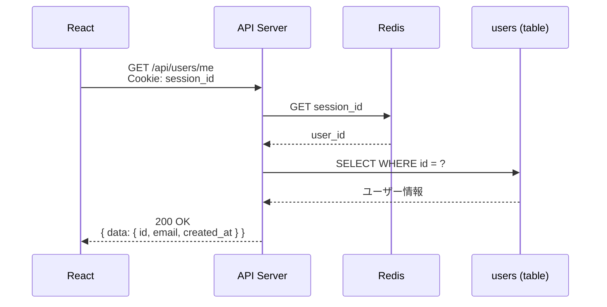
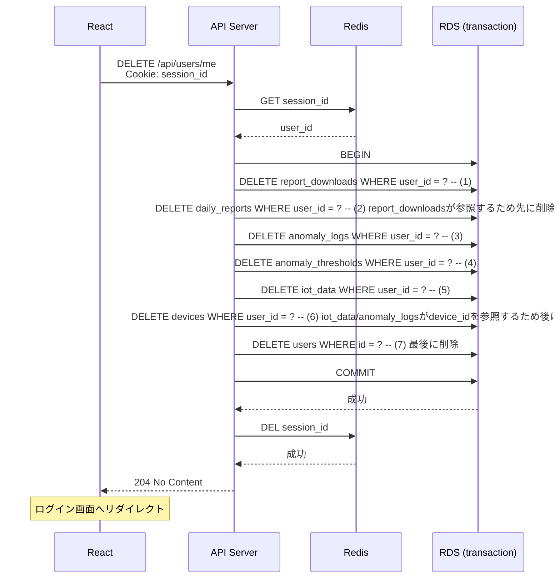
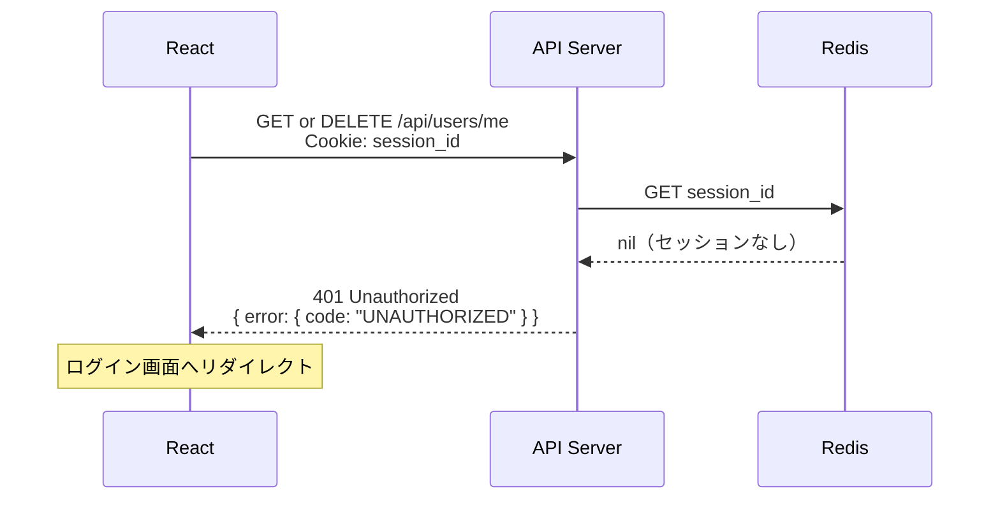
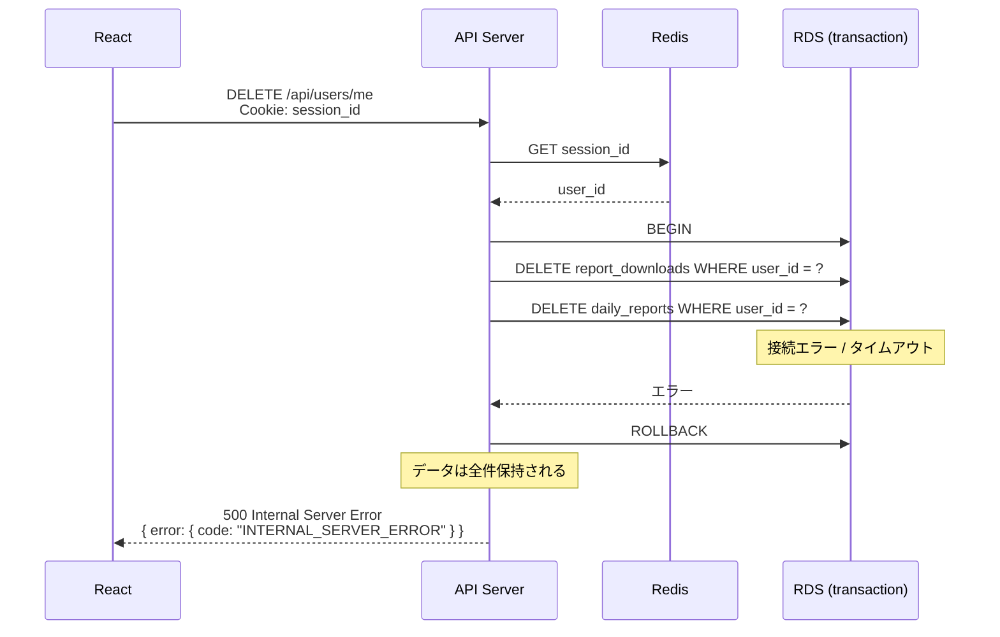
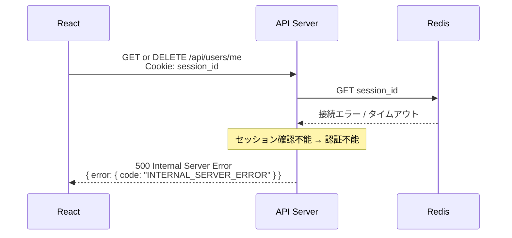

# シーケンス図: ユーザー管理

## Home Smart Factory -- IoT設備監視基盤

------------------------------------------------------------------------

# 1. 正常系

## 1.1 ユーザー情報取得

---

## 1.2 アカウント削除

関連する全データを同一トランザクション内で削除する。

------------------------------------------------------------------------

# 2. エラー系

## 2.1 未認証（セッション無効）

**発生箇所:** React → API Server

**原因:**
- セッションの有効期限切れ
- 不正な session_id

---

## 2.2 トランザクション失敗（アカウント削除時）

**発生箇所:** API Server → RDS

**原因:**
- RDS 障害 / 接続タイムアウト
- いずれかのDELETEが失敗

> **設計メモ:** ROLLBACKにより部分削除は発生しない。セッションはそのまま維持される。

---

## 2.3 Redis 障害

**発生箇所:** API Server → Redis

**原因:**
- Redis のダウン / 接続タイムアウト

------------------------------------------------------------------------

# 3. エラー対応まとめ

| エラー箇所 | エラー内容 | 挙動 | 備考 |
|---|---|---|---|
| React → API | セッション無効 | 401 返却・ログイン画面リダイレクト | 全エンドポイント共通 |
| API → RDS | トランザクション失敗 | ROLLBACK → 500 返却 | 部分削除は発生しない |
| API → Redis | Redis 障害 | 500 返却 | セッション確認不能のため認証不能 |
