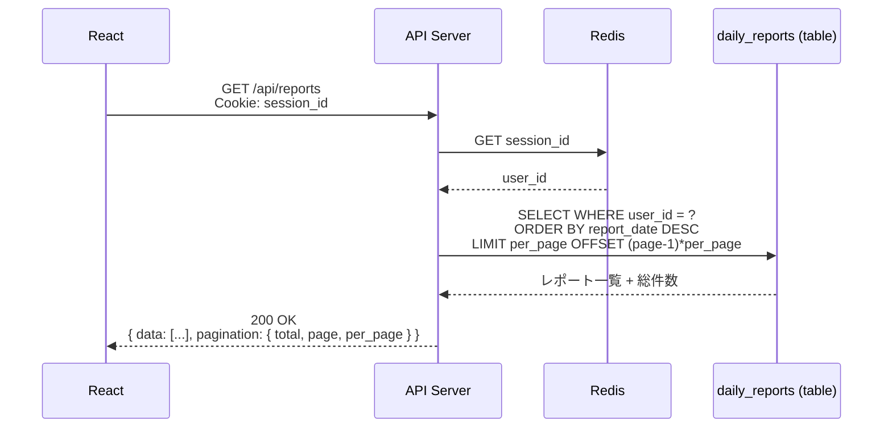
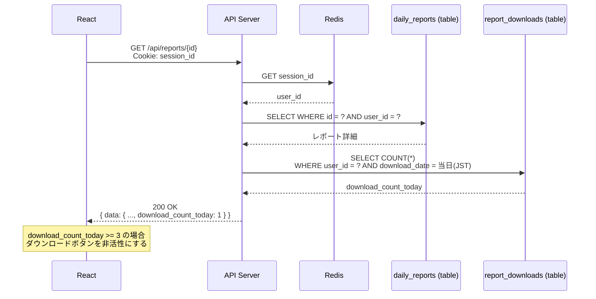
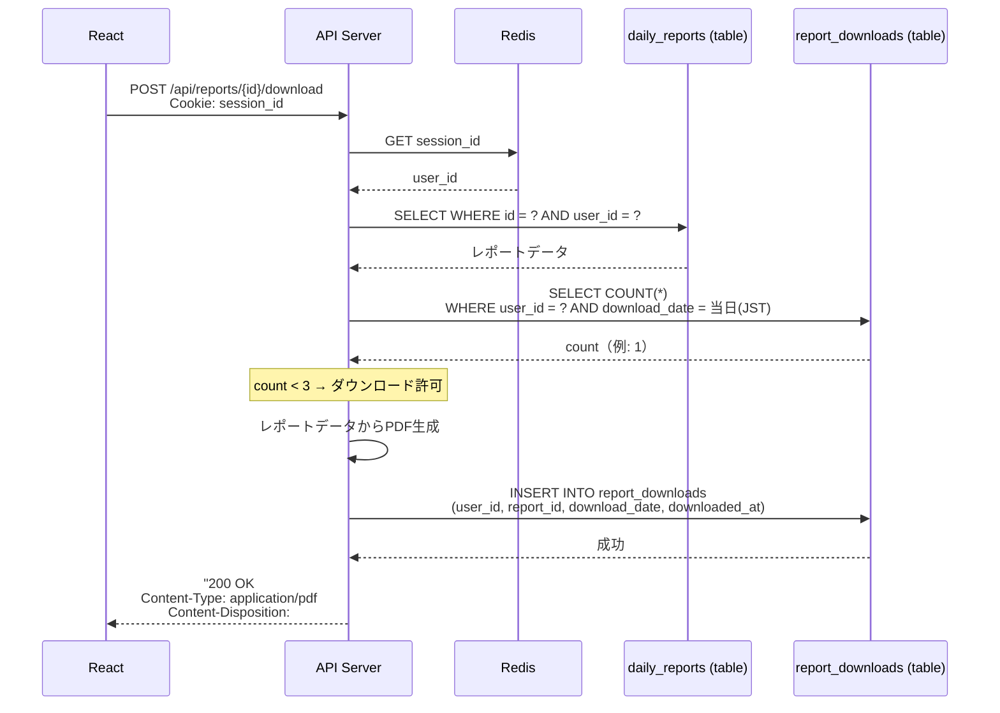
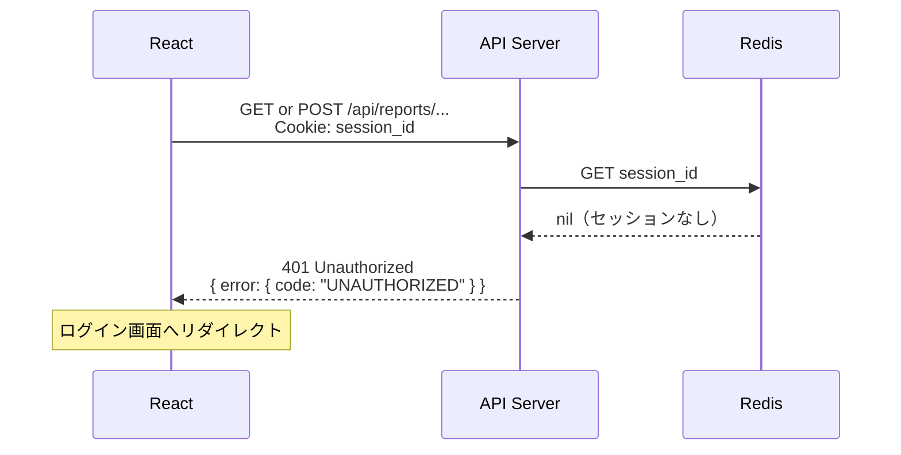
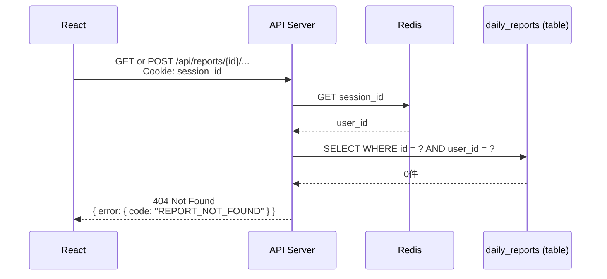
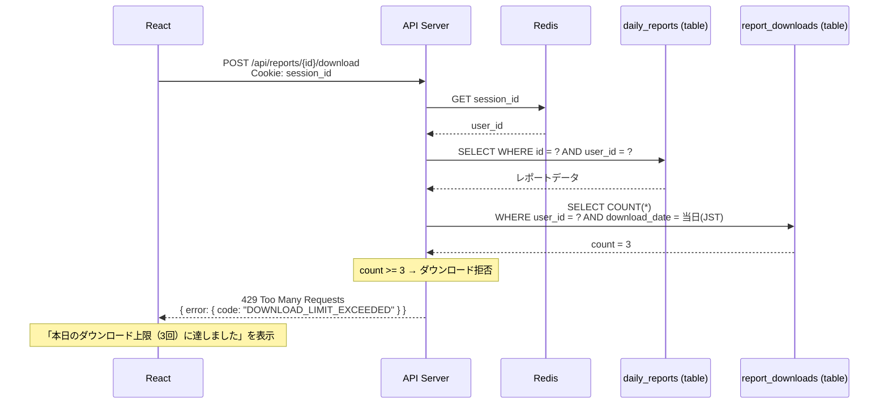
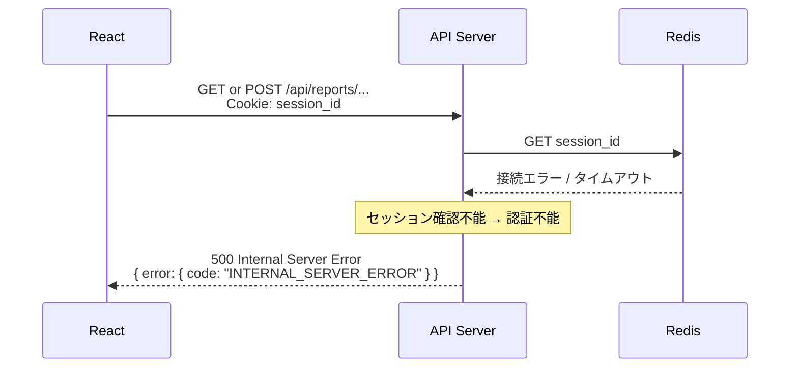
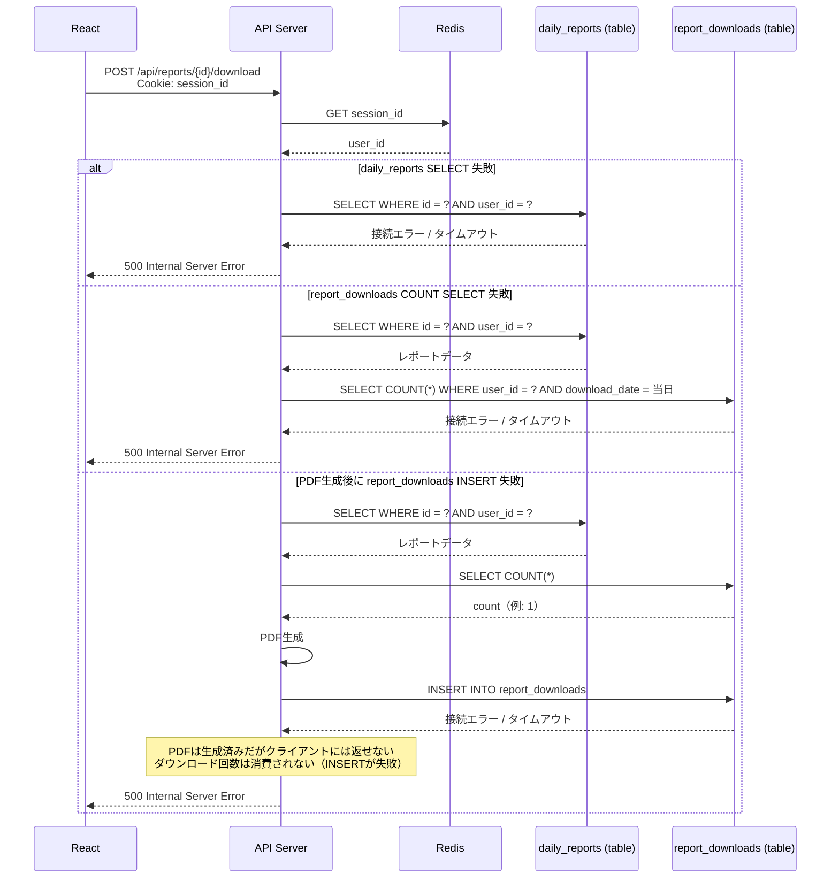

# シーケンス図: レポートダウンロード

## Home Smart Factory -- IoT設備監視基盤

------------------------------------------------------------------------

# 1. 正常系

## 1.1 レポート一覧取得

---

## 1.2 レポート詳細取得

`download_count_today` をレスポンスに含め、フロント側でダウンロードボタンの活性/非活性を制御する。

---

## 1.3 PDFダウンロード

------------------------------------------------------------------------

# 2. エラー系

## 2.1 未認証（セッション無効）

**発生箇所:** React → API Server

**原因:**
- セッションの有効期限切れ
- 不正な session_id

---

## 2.2 レポートが存在しない / 他ユーザーのレポート

**発生箇所:** API Server → daily_reports

**原因:**
- 指定した `id` が存在しない
- 他ユーザーのレポートへのアクセス

> **設計メモ:** 他ユーザーのレポートも404で返す。リソースの存在を推測させないため。

---

## 2.3 ダウンロード回数上限超過

**発生箇所:** API Server → report_downloads

**原因:**
- 当日のダウンロード回数が既に3回に達している

---

## 2.4 Redis 障害

**発生箇所:** API Server → Redis

**原因:**
- Redis のダウン / 接続タイムアウト

---

## 2.5 RDS 障害

**発生箇所:** API Server → daily_reports / report_downloads

**原因:**
- RDS のダウン / 接続タイムアウト

> **設計メモ:** PDF生成後にINSERT失敗した場合、ダウンロード回数が消費されないためユーザーは再試行できる。PDFバイナリはサーバー上に保持しないため、再試行時は再生成する。

------------------------------------------------------------------------

# 3. エラー対応まとめ

| エラー箇所 | エラー内容 | 挙動 | 備考 |
|---|---|---|---|
| React → API | セッション無効 | 401 返却・ログイン画面リダイレクト | 全エンドポイント共通 |
| API → daily_reports | レポートが存在しない / 他ユーザー | 404 返却 | 存在推測を防ぐため404に統一 |
| API → report_downloads | ダウンロード回数上限（3回/日） | 429 返却 | フロントでも事前に非活性制御 |
| API → Redis | Redis 障害 | 500 返却 | セッション確認不能のため認証不能 |
| API → RDS | RDS 障害（SELECT / INSERT） | 500 返却 | PDF生成後のINSERT失敗時はダウンロード回数消費されず再試行可能 |
