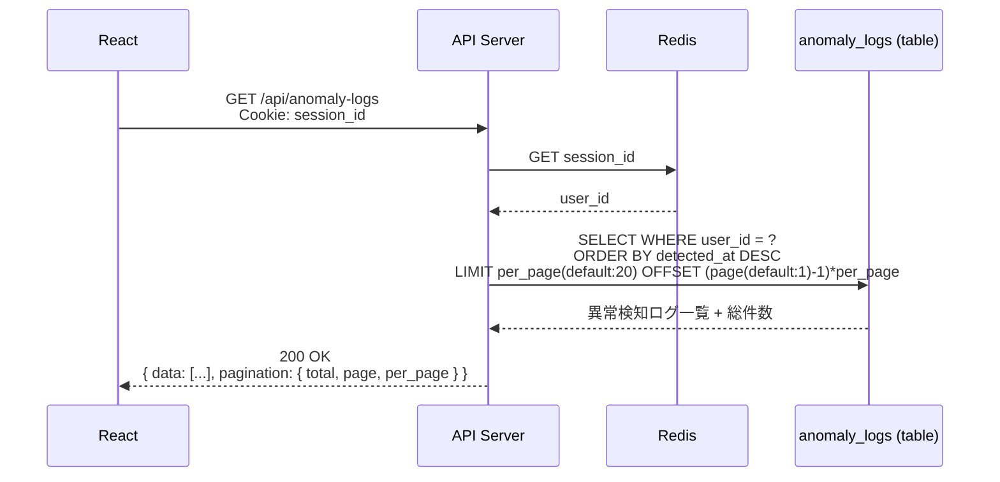
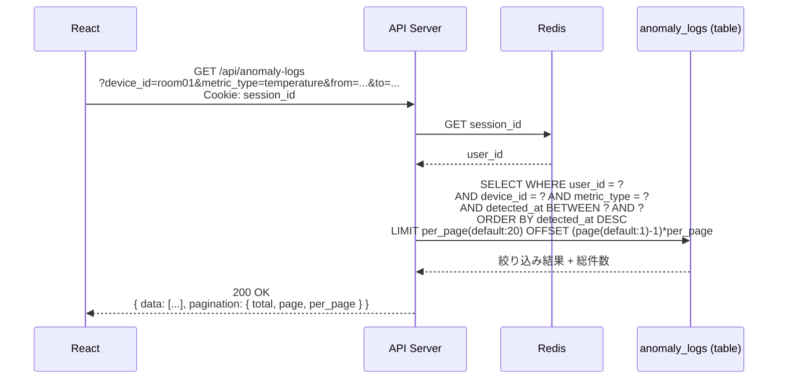
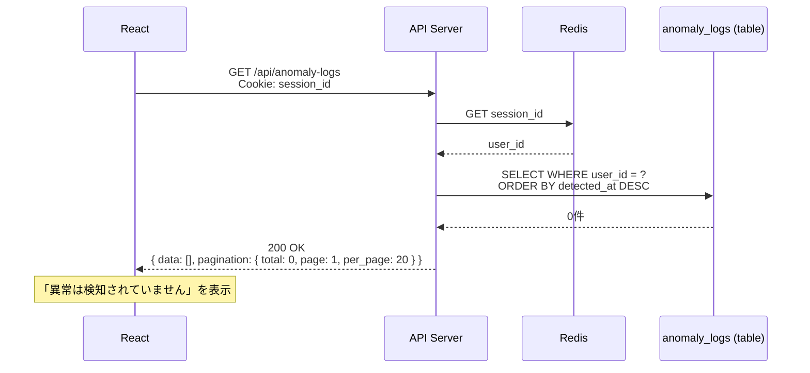
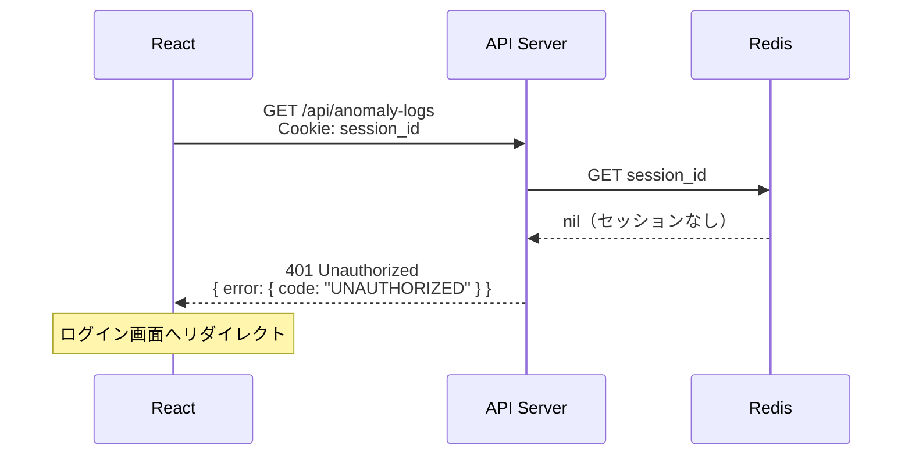
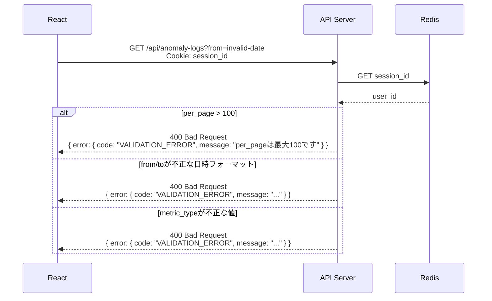

# シーケンス図: 異常一覧表示

## Home Smart Factory -- IoT設備監視基盤

------------------------------------------------------------------------

# 1. 正常系

## 1.1 異常一覧取得（フィルタなし）

異常検知ログを新しい順（detected_at DESC）で取得する。最新の異常を優先的に確認するため。

---

## 1.2 異常一覧取得（フィルタあり）

フィルタ条件（`device_id` / `metric_type` / `from` / `to`）を組み合わせて絞り込む。

---

## 1.3 異常なし（空リスト）

------------------------------------------------------------------------

# 2. エラー系

## 2.1 未認証（セッション無効）

**発生箇所:** React → API Server

**原因:**
- セッションの有効期限切れ
- 不正な session_id

---

## 2.2 不正なクエリパラメータ

**発生箇所:** API Server（リクエスト受信時）

**原因:**
- `from` / `to` に不正な日時フォーマット
- `per_page` が上限（100件）を超えている
- `metric_type` に不正な値

------------------------------------------------------------------------

# 3. エラー対応まとめ

| エラー箇所 | エラー内容 | 挙動 | 備考 |
|---|---|---|---|
| React → API | セッション無効 | 401 返却・ログイン画面リダイレクト | 全エンドポイント共通 |
| API（バリデーション） | 不正なクエリパラメータ | 400 返却 | DBアクセス前にチェック |
