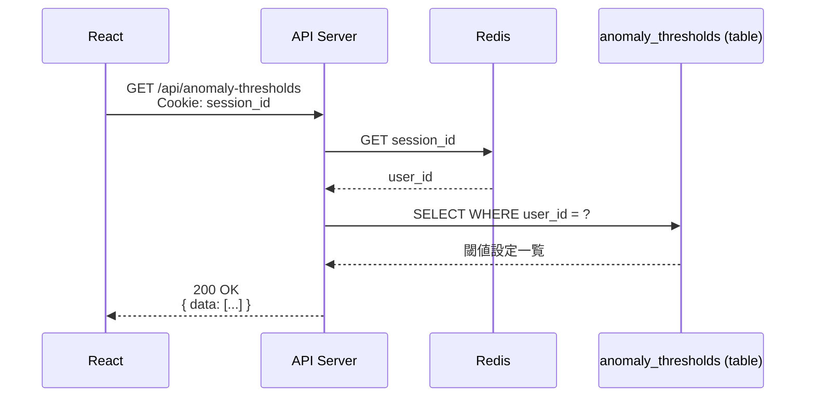
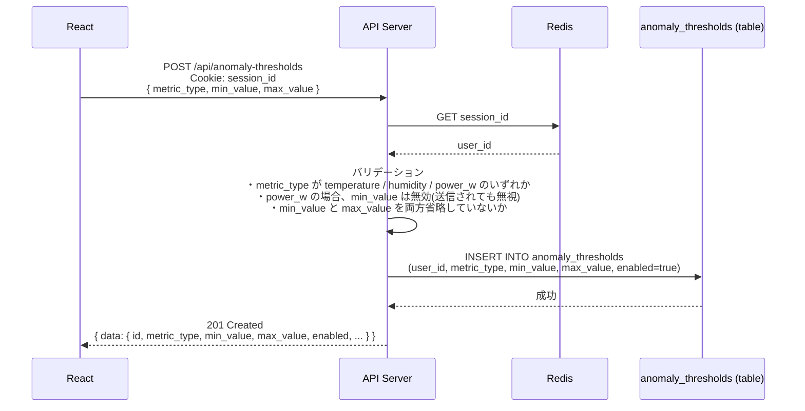
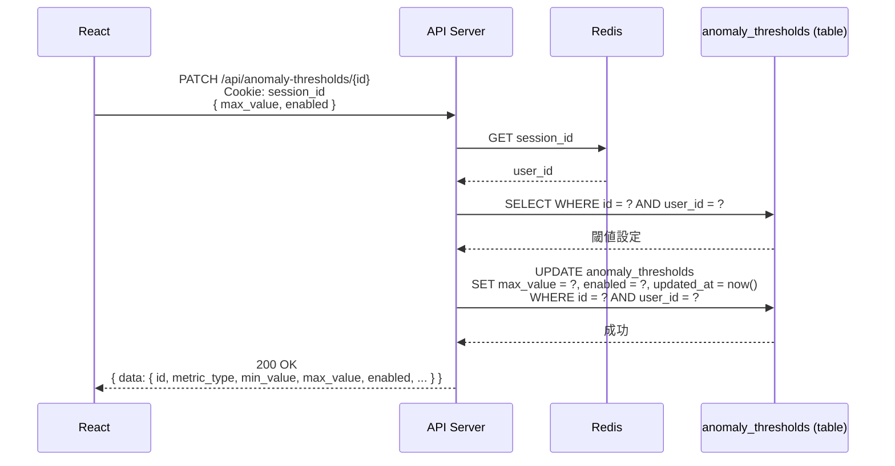
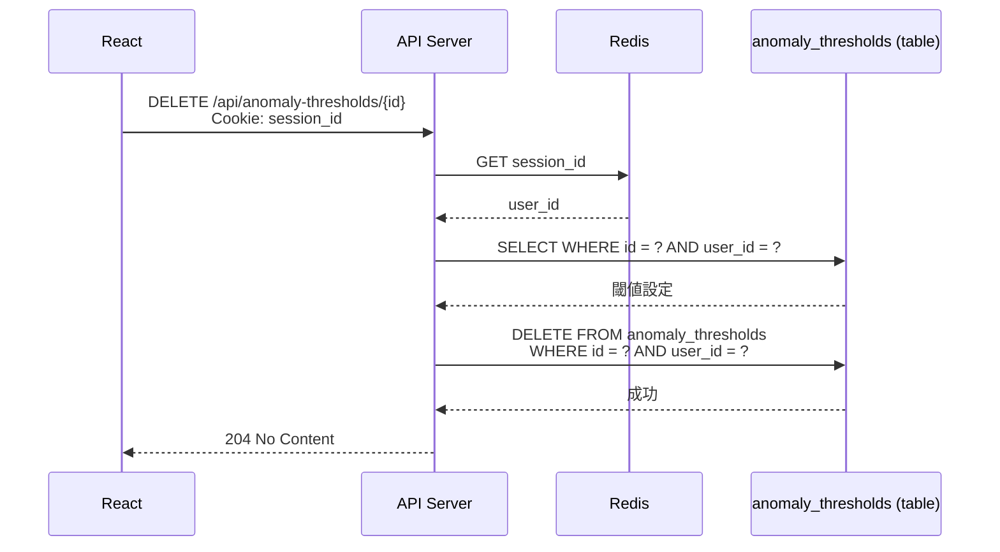
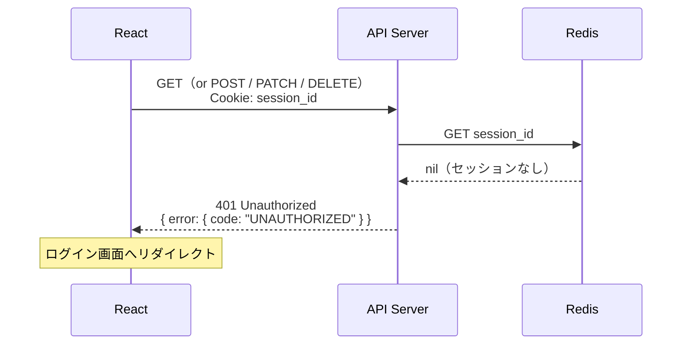
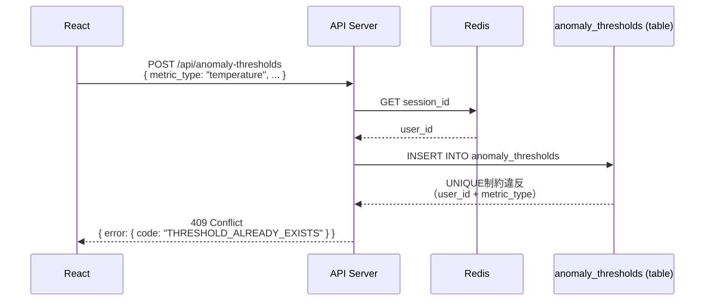
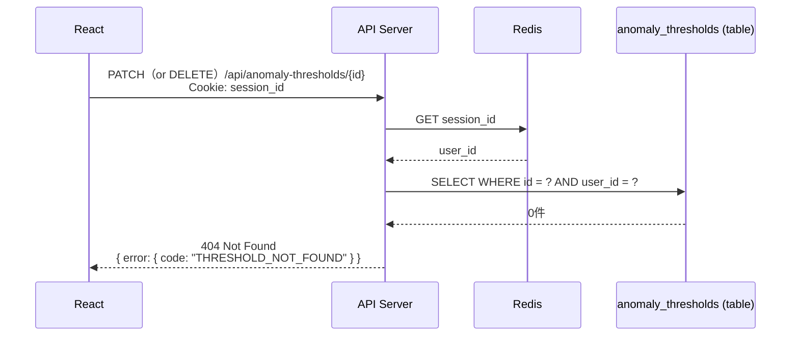
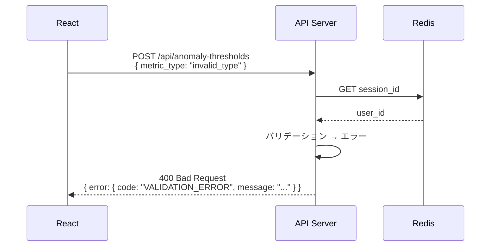

# シーケンス図: 閾値設定

## Home Smart Factory -- IoT設備監視基盤

------------------------------------------------------------------------

# 1. 正常系

## 1.1 閾値設定一覧取得

---

## 1.2 閾値設定新規作成

---

## 1.3 閾値設定更新

---

## 1.4 閾値設定削除

------------------------------------------------------------------------

# 2. エラー系

## 2.1 未認証（セッション無効）

**発生箇所:** React → API Server

**原因:**
- セッションの有効期限切れ
- 不正な session_id

---

## 2.2 重複登録（同一 metric_type）

**発生箇所:** API Server → anomaly_thresholds

**原因:**
- 同一ユーザーで同一 `metric_type` の閾値設定が既に存在する

---

## 2.3 存在しないリソースへの操作（PATCH / DELETE）

**発生箇所:** API Server → anomaly_thresholds

**原因:**
- 指定した `id` が存在しない
- 他ユーザーの閾値設定への操作

> **設計メモ:** `id` が存在しても `user_id` が一致しない場合は 404 を返す（403 ではなく）。他ユーザーのリソースの存在を推測させないため。

---

## 2.4 バリデーションエラー

**発生箇所:** API Server（リクエスト受信時）

**原因:**
- `metric_type` が不正な値
- `min_value` と `max_value` の両方が省略されている

------------------------------------------------------------------------

# 3. エラー対応まとめ

| エラー箇所 | エラー内容 | 挙動 | 備考 |
|---|---|---|---|
| React → API | セッション無効 | 401 返却・ログイン画面リダイレクト | 全エンドポイント共通 |
| API → anomaly_thresholds | 重複登録（同一metric_type） | 409 返却 | UNIQUE(user_id, metric_type) |
| API → anomaly_thresholds | 存在しないID / 他ユーザーのリソース | 404 返却 | 存在推測を防ぐため404に統一 |
| API（バリデーション） | 不正な metric_type / 値の省略 | 400 返却 | DBアクセス前にチェック |
