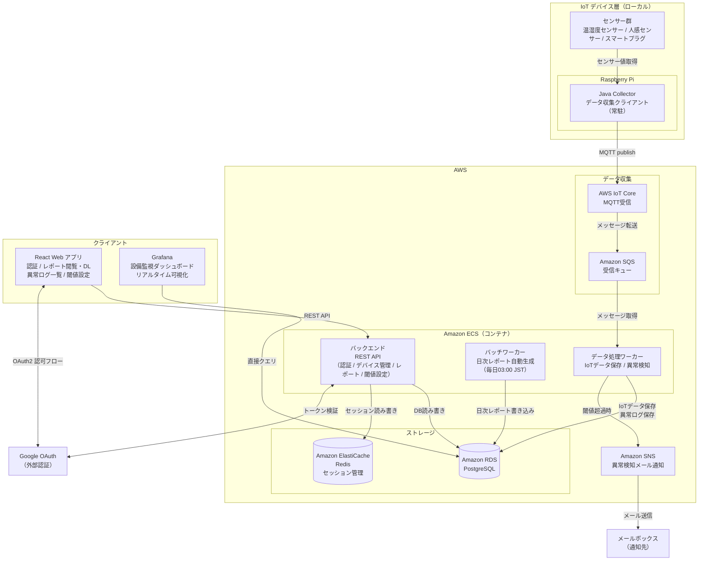

# システム構成図

## Home Smart Factory -- IoT設備監視基盤

------------------------------------------------------------------------



------------------------------------------------------------------------

# データフロー概要

## データ収集フロー（リアルタイム）

```
センサー群
  └─ Java Collector（センサー値取得・MQTT送信）
       └─ AWS IoT Core（MQTT受信）
            └─ Amazon SQS（キューイング）
                 └─ ECS データ処理ワーカー
                      ├─ RDS: iot_data 保存
                      ├─ RDS: 閾値チェック → anomaly_logs 保存
                      └─ SNS: 閾値超過時メール通知
```

## 日次レポート生成フロー（バッチ）

```
毎日 03:00 JST
  └─ ECS バッチワーカー
       └─ RDS: iot_data / anomaly_logs を集計
            └─ RDS: daily_reports 書き込み
```

## ユーザー操作フロー（Web）

```
ブラウザ（React）
  ├─ Google OAuth → セッション発行（Redis）
  ├─ REST API → ECS バックエンド → RDS
  │    ├─ デバイス管理（登録 / 更新 / 削除）
  │    ├─ 閾値設定（CRUD）
  │    ├─ 異常ログ一覧
  │    └─ レポート閲覧 / PDF ダウンロード
  └─ Grafana → RDS 直接クエリ（ダッシュボード表示）
```
