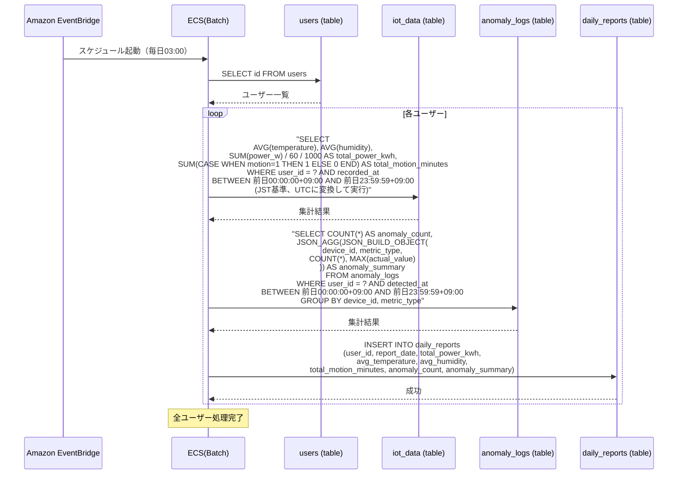
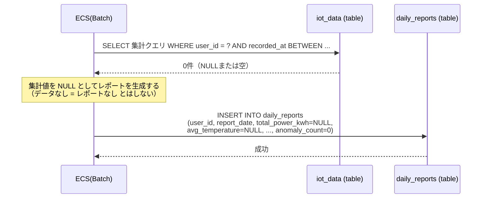
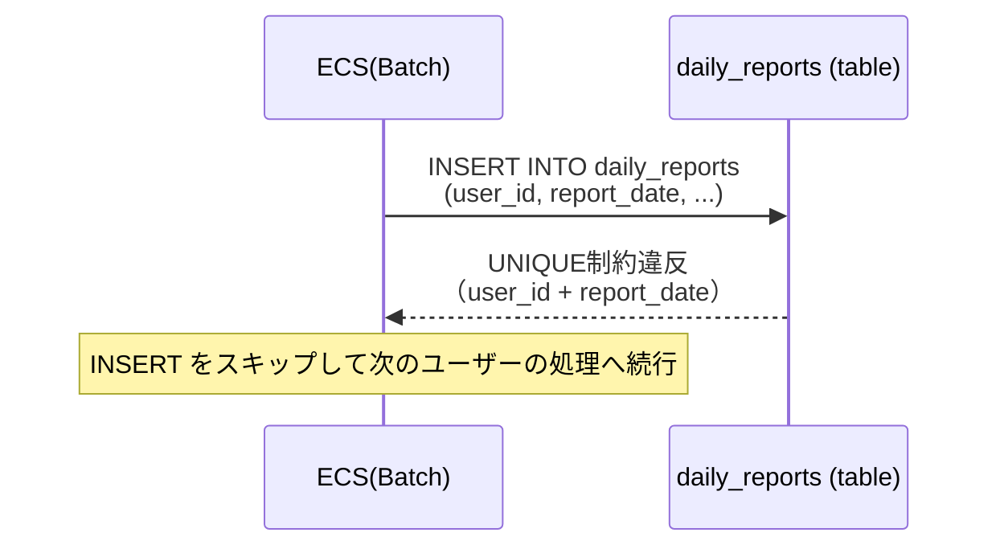
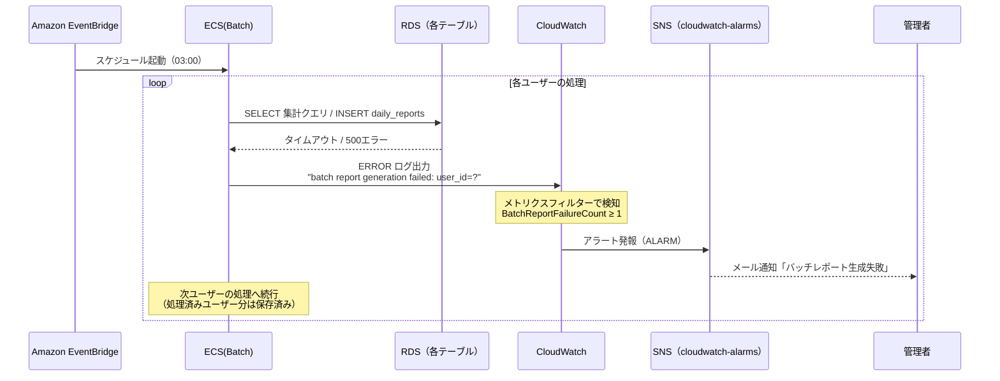
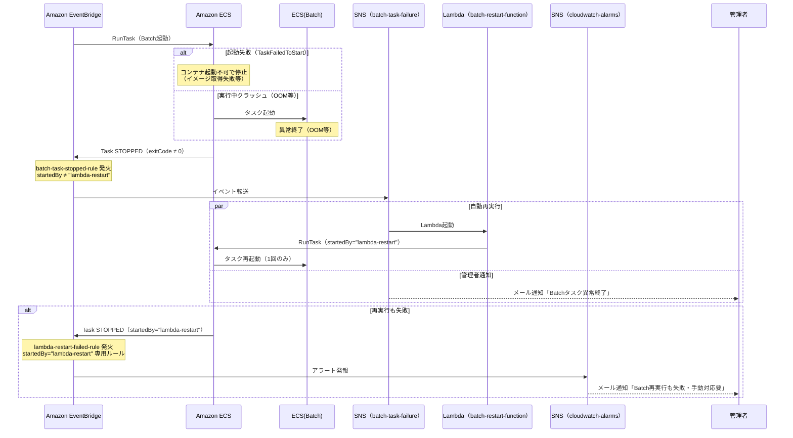

# シーケンス図: 日次レポート生成

## Home Smart Factory -- IoT設備監視基盤

------------------------------------------------------------------------

# 1. 正常系

**前提条件:**
- EventBridge のスケジュールにより毎日午前3時に ECS バッチが起動する
- 集計対象は前日 00:00〜23:59 のデータ
- 全ユーザー分を順次処理する（1ユーザー1レポート）

------------------------------------------------------------------------

# 2. エラー系

## 2.1 前日データなし（iot_data が0件）

**発生箇所:** ECS(Batch) → iot_data

**原因:**
- 前日に該当ユーザーのデバイスからデータが送信されなかった
- ユーザーが登録済みだがデバイスを持っていない

> **設計メモ:** データが0件でもレポートレコードは生成する。フロント側で NULL を「データなし」として表示する。

---

## 2.2 重複実行（同一 user_id + report_date）

**発生箇所:** ECS(Batch) → daily_reports

**原因:**
- EventBridge の二重起動
- 手動での再実行

> **設計メモ:** `INSERT ... ON CONFLICT (user_id, report_date) DO NOTHING` を使用し、重複時は静かにスキップする。

---

## 2.3 RDS 障害（集計・INSERT 失敗）

**発生箇所:** ECS(Batch) → RDS 各テーブル

**原因:**
- RDS 一時障害 / 接続タイムアウト

> **設計メモ:** 個別ユーザーのRDS障害は ERROR ログ出力 + CloudWatch Alarm で管理者へ通知する。タスクは継続し処理済みユーザー分のレポートは保存される。ECS タスク自体が異常終了した場合は後述 2.4 を参照。

---

## 2.4 ECS Batch 異常終了・起動失敗

**発生箇所:** Amazon EventBridge → ECS(Batch)

**原因:**
- コンテナイメージ取得失敗（TaskFailedToStart）
- OOM / プロセス異常終了（実行中クラッシュ）

> **設計メモ:** `batch-task-failure` SNS に管理者メールサブスクリプションを追加し、Lambda 自動再実行と並列で管理者へ通知する。Lambda 再実行後も失敗した場合は `lambda-restart-failed-rule`（EventBridge, 新規）が `startedBy="lambda-restart"` のタスク停止を検知し `cloudwatch-alarms` SNS 経由で管理者へ追加通知する。

------------------------------------------------------------------------

# 3. エラー対応まとめ

| エラー箇所 | エラー内容 | 挙動 | データロスト |
|---|---|---|---|
| ECS(Batch) → iot_data | 前日データ0件 | NULL値でレポートを生成 | なし |
| ECS(Batch) → daily_reports | 重複実行 | INSERTスキップ（ON CONFLICT DO NOTHING）・次ユーザーへ続行 | なし |
| ECS(Batch) → RDS | RDS一時障害（個別ユーザー） | ERRORログ出力・CloudWatch Alarm で管理者通知・次ユーザーへ続行 | あり（該当ユーザー分） |
| EventBridge → ECS(Batch) | 起動失敗・実行中クラッシュ | EventBridge→SNS→Lambda 自動再実行（1回）+ 管理者メール通知 | なし（再実行で復旧） |
| EventBridge → ECS(Batch) | 再実行も失敗 | lambda-restart-failed-rule → cloudwatch-alarms → 管理者メール通知 | あり（未処理ユーザー分） |
