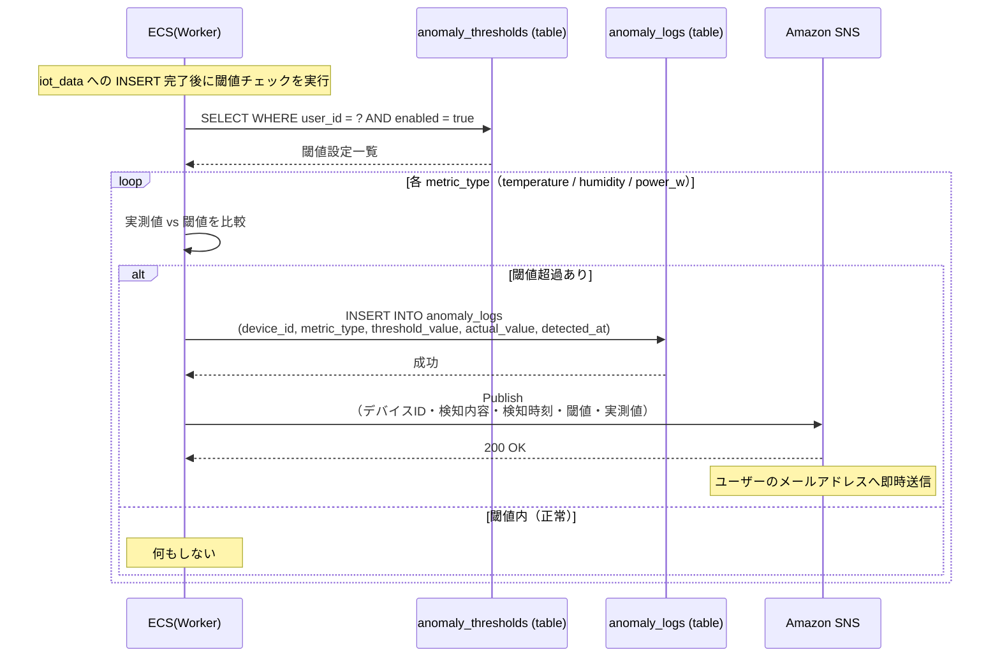
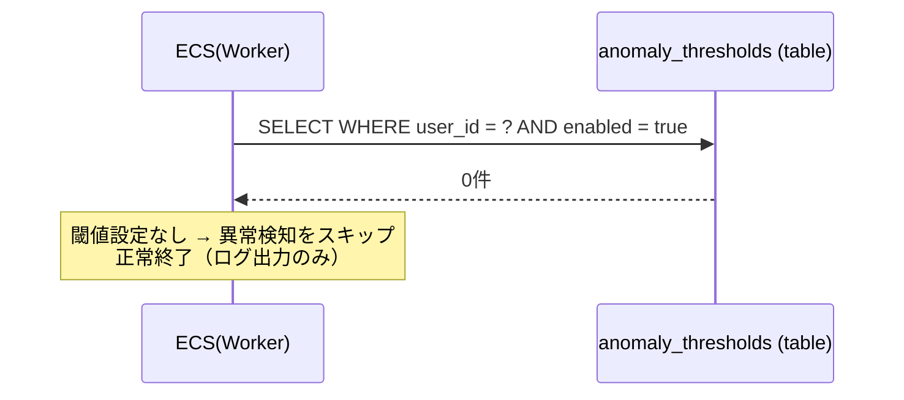
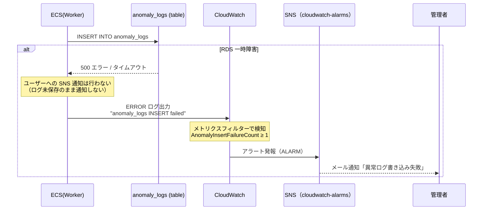
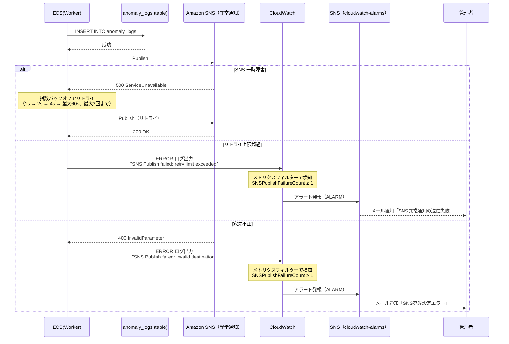

# シーケンス図: 異常検知

## Home Smart Factory -- IoT設備監視基盤

------------------------------------------------------------------------

# 1. 正常系

IoTデータ保存後、ECS(Worker) が閾値チェックを行い、異常を検知した場合は anomaly_logs へ記録し SNS でメール通知する。

**前提条件:**
- ECS(Worker) が SQS からメッセージを受信し、iot_data への INSERT が完了済み
- ユーザーの閾値設定（anomaly_thresholds）が1件以上 enabled=true で登録されている

------------------------------------------------------------------------

# 2. エラー系

## 2.1 閾値設定が存在しない（未設定 / すべて disabled）

**発生箇所:** ECS(Worker) → anomaly_thresholds

**原因:**
- ユーザーが閾値を一度も設定していない
- すべての閾値設定が `enabled=false`

---

## 2.2 anomaly_logs 書き込み失敗

**発生箇所:** ECS(Worker) → anomaly_logs

**原因:**
- RDS 一時障害 / 接続タイムアウト

> **設計メモ:** anomaly_logs の INSERT に失敗した場合、ユーザーへの SNS 通知は行わない（ログ未保存のまま通知しない）。ただしエラーログ（"anomaly_logs INSERT failed"）を CloudWatch Logs へ出力し、メトリクスフィルター + Alarm 経由で管理者へ通知する。

---

## 2.3 SNS 通知失敗

**発生箇所:** ECS(Worker) → Amazon SNS

**原因:**
- SNS 一時障害
- 宛先メールアドレスの不正

> **設計メモ:** ユーザーへの SNS 通知失敗は許容する（anomaly_logs は保存済みのため、ユーザーは画面から異常一覧を確認可能）。ただしリトライ上限超過・宛先不正は管理者へ CloudWatch Alarm で通知する。

------------------------------------------------------------------------

# 3. エラー対応まとめ

> **補足:** 異常検知は IoTデータ収集フロー（iot_data への INSERT）が完了した後に実行される。閾値チェック・ログ保存・SNS通知は独立した処理として扱い、失敗しても SQS のリトライ対象にはならない。

| エラー箇所 | エラー内容 | 挙動 | データロスト |
|---|---|---|---|
| ECS(Worker) → anomaly_thresholds | 閾値設定なし / 全disabled | 異常検知スキップ・正常終了 | なし |
| ECS(Worker) → anomaly_logs | RDS一時障害 | ユーザー通知しない・CloudWatch Alarm で管理者へ通知 | あり（異常ログ） |
| ECS(Worker) → SNS | SNS一時障害 | 指数バックオフでリトライ | なし（ログは保存済み） |
| ECS(Worker) → SNS | リトライ上限超過 | CloudWatch Alarm で管理者へ通知 | なし（ログは保存済み） |
| ECS(Worker) → SNS | 宛先不正（400） | リトライしない・CloudWatch Alarm で管理者へ通知 | なし（ログは保存済み） |
