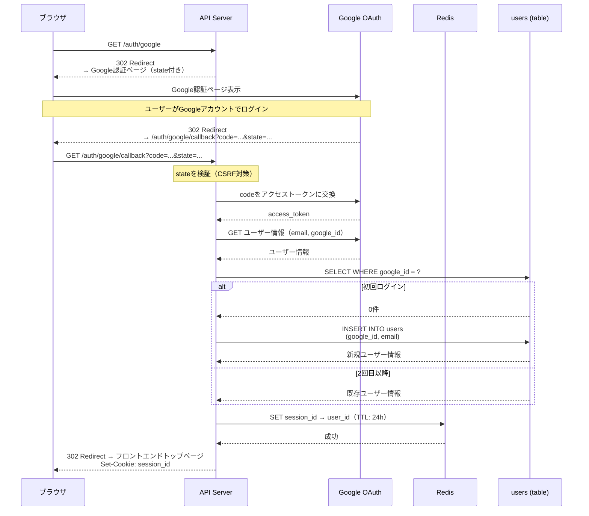
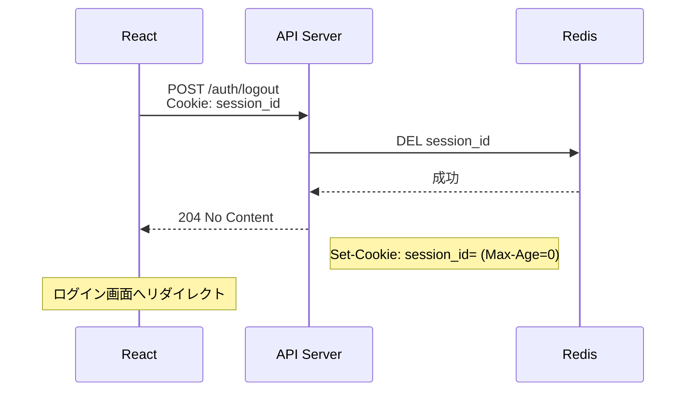
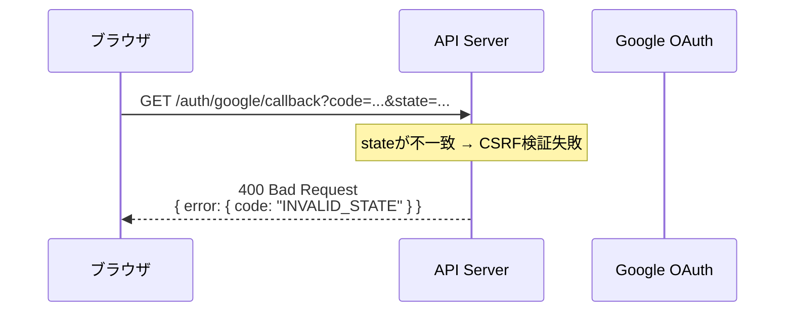
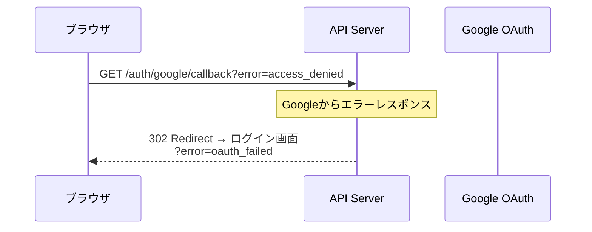
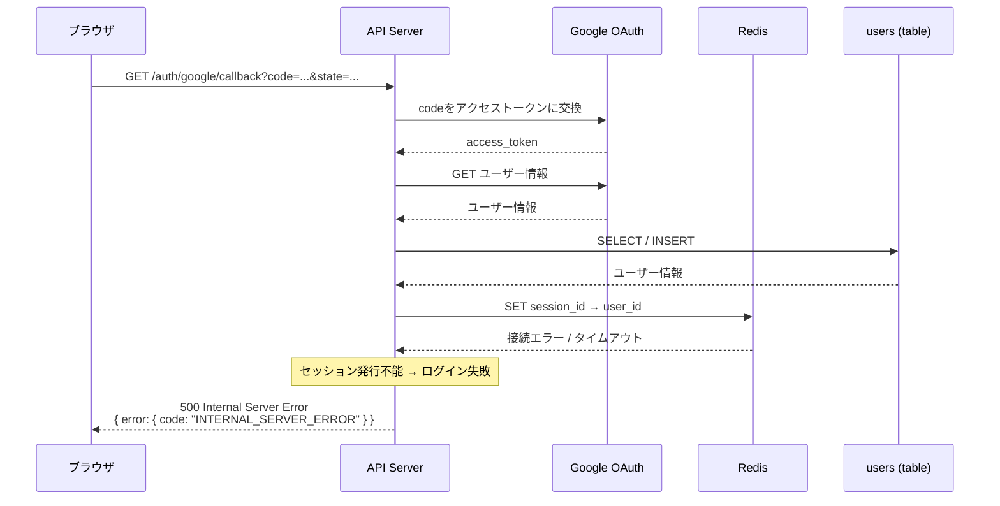
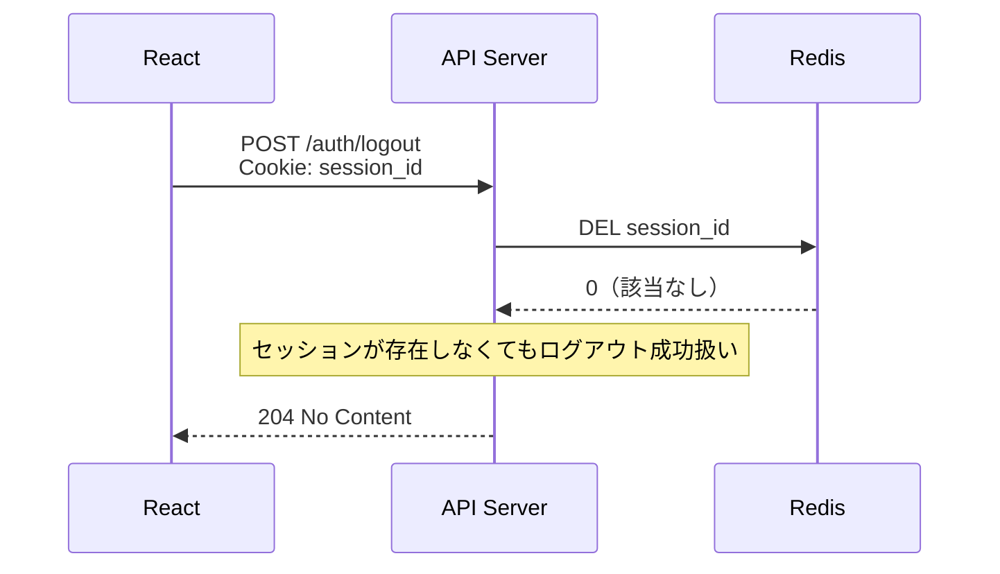

# シーケンス図: 認証

## Home Smart Factory -- IoT設備監視基盤

------------------------------------------------------------------------

# 1. 正常系

## 1.1 ログイン（初回 / 2回目以降共通）

---

## 1.2 ログアウト

------------------------------------------------------------------------

# 2. エラー系

## 2.1 state 不一致（CSRF検証失敗）

**発生箇所:** API Server（コールバック受信時）

**原因:**
- CSRF攻撃
- セッション切れによりstate消失

---

## 2.2 Google OAuth エラー

**発生箇所:** API Server → Google OAuth

**原因:**
- ユーザーが認証をキャンセル
- codeが無効 / 期限切れ

---

## 2.3 Redis 障害（セッション保存失敗）

**発生箇所:** API Server → Redis

**原因:**
- Redis のダウン / 接続タイムアウト

---

## 2.4 ログアウト時のセッション不在

**発生箇所:** API Server → Redis

**原因:**
- 既にログアウト済み
- セッションが有効期限切れ

> **設計メモ:** ログアウトは冪等に扱う。セッションが存在しない場合も204を返す。

------------------------------------------------------------------------

# 3. エラー対応まとめ

| エラー箇所 | エラー内容 | 挙動 | 備考 |
|---|---|---|---|
| コールバック受信時 | state不一致 | 400 返却 | CSRF対策 |
| API → Google | 認証キャンセル / codeエラー | ログイン画面へリダイレクト | error=oauth_failed |
| API → Redis | セッション保存失敗 | 500 返却 | ログイン失敗 |
| POST /auth/logout | セッション不在 | 204 返却（正常扱い） | 冪等処理 |
